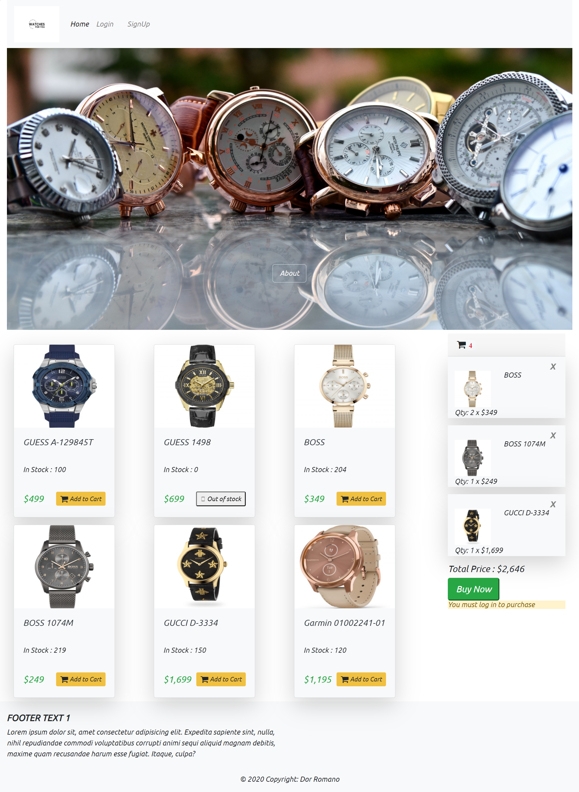
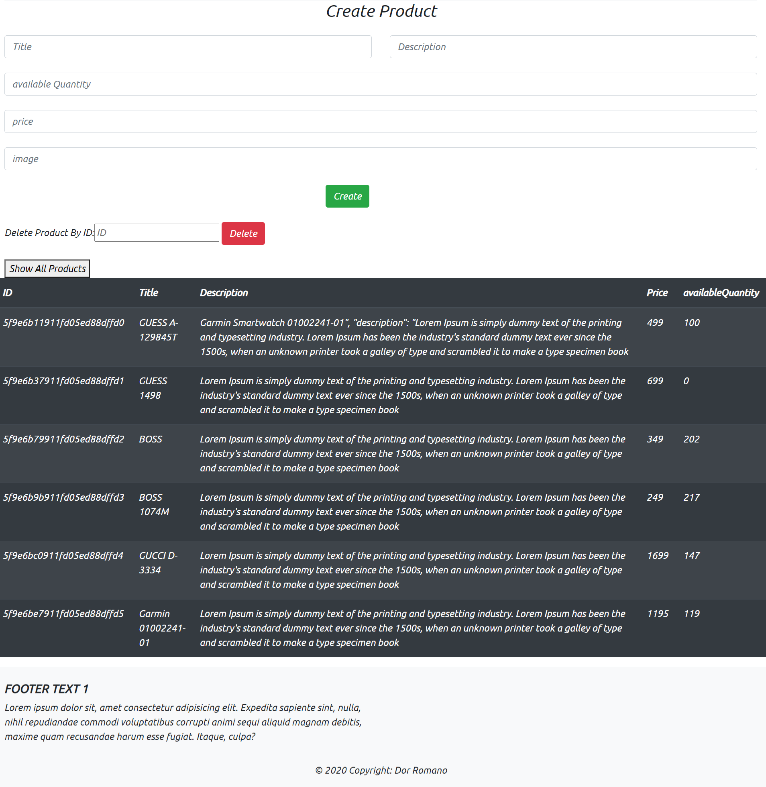
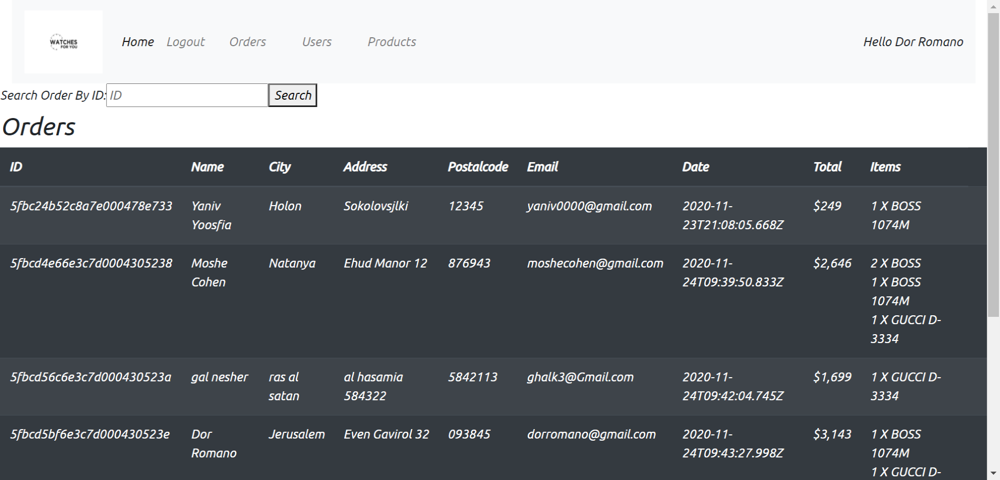
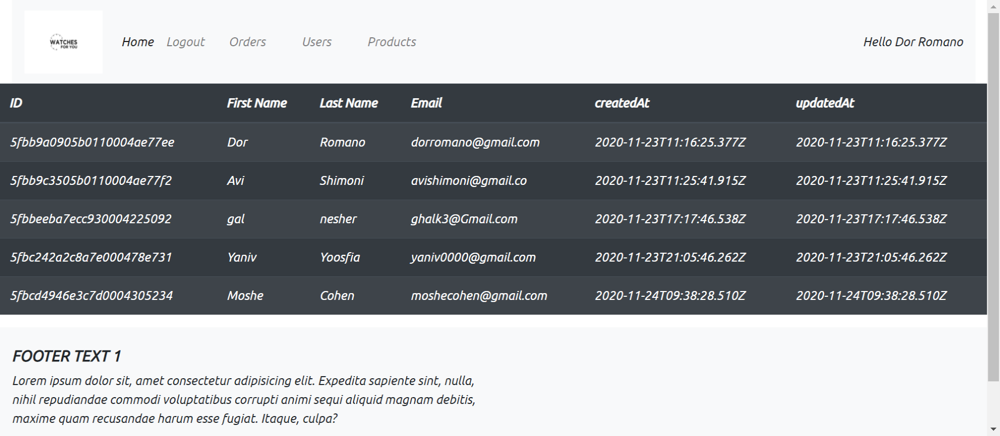

# Ecommerce Shop

---
>Implemented MERN Stack CRUD Operations with React, Node.js, MongoDB and Express.

## Table of contents
* [General info](#general-info)
* [Screenshots](#screenshots)
* [Technologies](#technologies)
* [Setup](#setup)
* [Features](#features)
* [Contact](#contact)

## General info
The 'Ecommerce Shop' is a web application that demonstrates an ecommerce website.
For the client side i used 'React' , and for the backend/server side i used 'ExpressJS and MongoDB.
The client side communicates with the server through HTTP requests. 

### Flow
1. The user views the React web app with a browser.
2. The React front end communicates with the Express back end via RESTful APIs.
3. The back-end Express application uses the Mongo database for storing and retrieving data.
4. Back-end results are communicated back to the the front end.
5. Authentication user role for make Purchase or admin actions.
6. The React front-end stored the results in Redux store.
7. Front-end results are rendered in a human readable format to the user.

## Screenshots
#### Home Page :

#### Admin pages:

## Technologies
Client-side | Server-side
--- | ---
react: ^16.13.1| bcryptjs: ^2.4.3
react-dom: ^16.13.1|dotenv: ^8.2.0
react-modal: ^3.11.2| express: ^4.17.1
react-redux: ^7.2.1 |joi: ^17.2.1
react-dom: ^16.2.0 | express: ^4.14.0
react-reveal: ^1.2.2| jsonwebtoken: ^8.5.1
react-router-dom: ^5.2.0 | mongoose: ^5.10.7
redux: ^4.0.5 |
redux-thunk: ^2.3.0 |

## Setup
---
### Demo Live: https://gals-ecommerce-shop.web.app/
 

Clone this repo to your desktop and run npm install to install all the dependencies.
### Server Side :
After you clone this repo to your desktop, go to its root directory and run npm install to install its dependencies.
>cd server  
>npm install 

Once the dependencies are installed, you can run npm start to start the application. You will then be able to access it at localhost:5000
>npm run start

### Client Side :
After you clone this repo to your desktop, go to its root directory and run npm install to install its dependencies.
>cd client  
>npm install 

Once the dependencies are installed, you can run npm start to start the application. You will then be able to access it at localhost:3000
>npm start

## Features

<b>Products Features</b>
| Feature  |  Coded?       | Description  |
|----------|:-------------:|:-------------|
| Add a Product | &#10004; |Only in 'Admin Mode' you can 'Add a Product' to the System |
| List Products | &#10004; | Ability of List Products |
| Delete a Product | &#10004; |Only in 'Admin Mode' you can 'Delete a Product' from the System |

<b>Users Features</b>
| Feature  |  Coded?       | Description  |
|----------|:-------------:|:-------------|
| Add a User | &#10004; | Ability of Add a User on the System |
| List Users | &#10004; |Only in 'Admin Mode' you can see list of all users from the System |

<b>Purchase Features</b>

| Feature  |  Coded?       | Description  |
|----------|:-------------:|:-------------|
| See Cart | &#10004; | Ability to see the Cart and it items |
| Add Item | &#10004; | Ability of add a new Item on the Cart |
| Remove a Item | &#10004; | Ability of Remove a Item from the Cart |
| Checkout |&#10004;| Ability to Checkout |
|Orders| &#10004; |Only in 'Admin Mode' you can see list of all orders from the System|
|Search Order|&#10004; |Only in 'Admin Mode' you can search Order by ID from the System|
 

## Contact
Created by [Gal Nehser](https://www.linkedin.com/in/gal-nesher-153a881a3/) - feel free to contact me!
